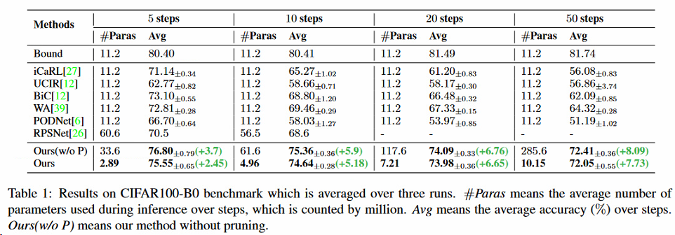
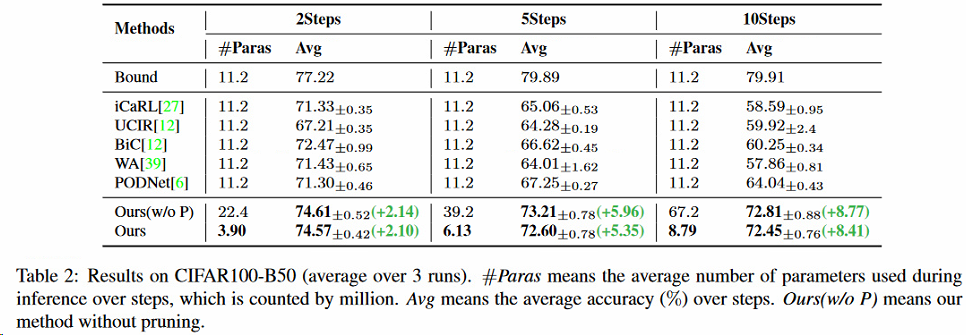
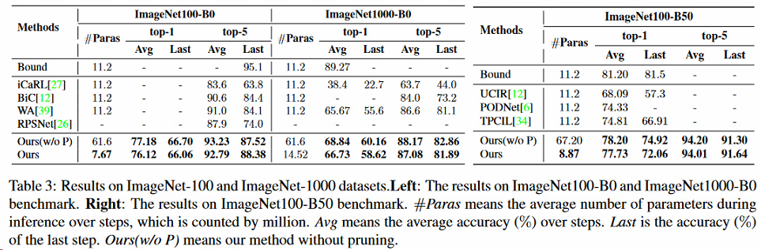
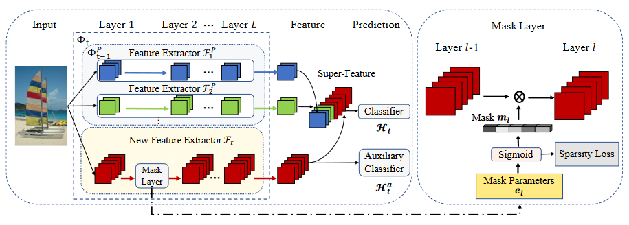

# motivation

有限记忆空间的类增量学习

# 结论

# 数据

CIFAR-100, ImageNet-100, ImageNet-1000

**CIFAR100**: 1)CIFAR100-B0: we follow the protocol proposed in [27], which trains all 100 classes in several splits including 5, 10, 20, 50 incremental steps with fixed memory size of 2,000 exemplars over batches; 2)CIFAR100-B50: we follow the protocol introduced in [12], which starts from a model trained on 50 classes, and the remaining 50 classes are divided into splits of 2, 5, and 10 steps with 20 examples as memory per class. 

**ImageNet-100**: 1)ImageNet100-B0: the protocol [27] trains the model in batches of 10 classes from scratch with fixed memory size 2,000 over batches; 2)ImageNet100B50: the protocol [12] starts from a model trained on 50 classes, and the remaining 50 classes come in 10 steps with 20 examples per class as memory. For the sake of fairness, we use the same ImageNet subset and class order following the protocols [27, 12]. 

**ImageNet-1000**: We evaluate our method on the protocol [27], known as ImageNet1000-B0 benchmark, that trains the model in batches of 100 classes with 10 steps in total and set the fixed memory size as 20,000. Detailedly, we use the same class order as [27] for ImageNet-1000.

[12] Saihui Hou, Xinyu Pan, Chen Change Loy, Zilei Wang, and Dahua Lin. Learning a unified classifier incrementally via rebalancing. In Proceedings of the IEEE conference on computer vision and pattern recognition (CVPR), 2019.

[27] Sylvestre-Alvise Rebuffi, Alexander Kolesnikov, Georg Sperl, and Christoph H Lampert. icarl: Incremental classifier and representation learning. In Proceedings of the IEEE conference on computer vision and pattern recognition (CVPR), 2017.
# 性能

文章内：

**复现（环境**）：

# code

https://github.com/Rhyssiyan/DER-ClassIL.pytorch
# 结构

两步实现：特征提取采用冻结手段保留前次参数，新增参数使用减值方法抑制参数爆炸。分类器训练新增一个辅助损失，将过去所有类别归为一类，与新增类别一起构成辅助分类器。

# 切片

1. Human can easily accumulate visual knowledge from past experiences and incrementally learn novel concepts. Inspired by this, the problem of class incremental learning aims to design algorithms that can learn novel concepts in a sequential manner and eventually perform well on all observed classes. Such capability is indispensable for many real-world applications such as the intelligent robot [31], face recognition [19] and autonomous driving [25]. （人可以轻松地从过去的经验中积累视觉知识，并逐步学习新颖的概念。受此启发的启发，类增量学习的问题旨在设计算法，这些算法可以依次学习新颖的概念，并最终在所有观察到的类中表现良好。对于许多实际应用，例如智能机器人[31]，面部识别[19]和自主驾驶[25]，这种功能是必不可少的。）
2. In particular, it requires a model to effectively incorporate novel concepts without forgetting the existing knowledge, which is also known as stability-plasticity dilemma [9]. In detail, excessive plasticity often causes large performance degradation of the old categories, referred to as catastrophic forgetting [8]. On the contrary, excessive stability impedes the adaptation of novel concepts.（特别是，它需要一个模型才能有效地合并新的概念而不忘记现有知识，这也称为稳定性困境[9]。详细说明，过度可塑性通常会导致旧类别的大量性能降解，被称为灾难性遗忘[8]。相反，过度稳定性阻碍了新颖概念的适应。）
3. decoupling（解耦，脱钩）
4. We design an auxiliary loss on the novel extractor to promote it to learn diverse and discriminative features.（我们在新的提取器上设计了辅助损失，以促进它以学习多样化和有区别的特征。）
5. $p_{H_t}(y|x) = Softmax(H_t(u))$.
6. 